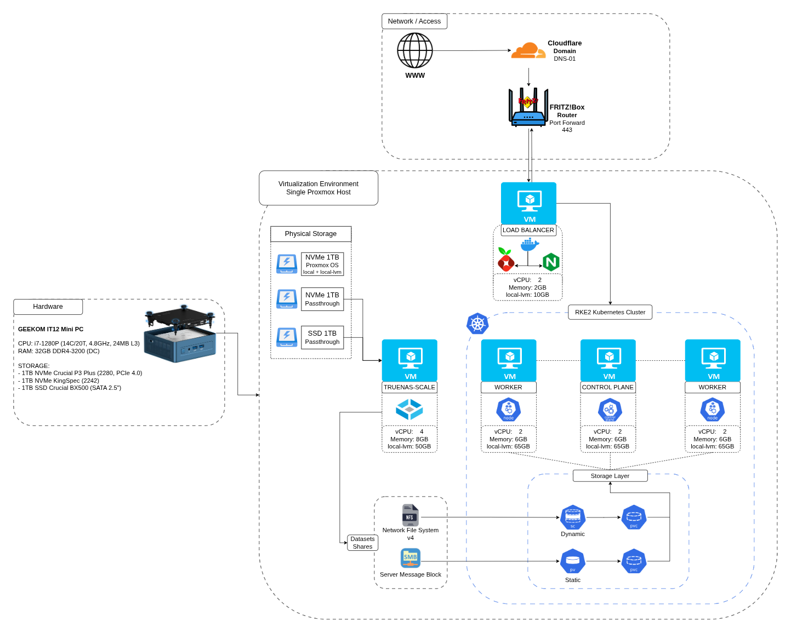
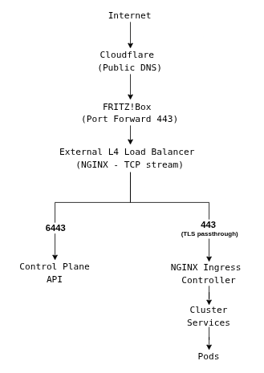

# k8s-on-proxmox

Kubernetes (RKE2) on Proxmox homelab with infrastructure documentation and deployment manifests.

## Overview

This repository documents my personal homelab platform built around Kubernetes (RKE2) running on a single Proxmox VE host.

Although the environment runs on a single physical machine and does not currently provide high availability, the cluster is intentionally structured as a multi-node setup (one control plane and two workers). I chose RKE2 over a lightweight single-node distribution (such as K3s) to better reflect production-oriented Kubernetes deployments patterns and to establish an architecture designed to evolve toward true high availability in the future.

This project serves as both a structured learning environment and a documented reference for infrastructure design, cluster bootstrap, storage integration, and workload deployment.

## Architecture

### Logical Infrastructure Overview

The platform runs on a single physical node (GEEKOM IT12 Mini PC) hosting Proxmox VE as the hypervisor. All virtual machines and storage services are deployed on this host.

The diagram represents the logical architecture of the homelab. While everything runs on a single physical host, the stack is intentionally structured following production-oriented architectural patterns: separated control plane, dedicated storage layer, external load balancer, and proper ingress flow.

This is not a "throw everything in one VM" lab, it's designed to model real infrastructure boundaries, even within the constraints of a single-node setup.

## Physical & Virtualization Layer

The entire platform runs on a **GEEKOM IT12 Mini PC** (Intel i7-1280P, 32GB RAM), hosting **Proxmox VE** as the hypervisor.

Disk layout is structured:

- **NVMe #1 (1TB)** -> Proxmox OS + local-lvm storage
- **NVMe #2 (1TB)** -> Passed through to TrueNAS
- **SATA SSD (1TB)** -> Passed through to TrueNAS

Storage management is delegated to a dedicated VM to preserve proper separation of concerns.

## Storage Layer

Persistent storage is provided by a dedicated **TrueNAS SCALE VM** with direct disk passthrough.

TrueNAS was selected primarily for its operational simplicity: dataset management, ACL handling, share configuration, and visibility into storage state are all exposed through a clean interface. This makes the storage layer easy to reason about and maintain.

Additionally, decoupling storage into a dedicated VM leaves space for future evolution. The TrueNAS instance can be migrated to dedicated hardware with additional disks, enabling proper RAID configurations, improved redundancy, and a more structured backup strategy.

This VM manages ZFS pools and exposes storage to Kubernetes using two different models:

### 1. Dynamic Provisioning (NFS v4)

For dynamic provisioning, storage is exposed over NFSv4 and backed directly by ZFS datasets managed within TrueNAS. Kubernetes integrates with the storage layer through the `nfs-subdir-external-provisioner`, which automatically creates subdirectories for each PersistentVolumeClaim. PVCs are created on demand, with no need for manual volume preparation, making it ideal for most stateless or semi-stateful applications deployed in the cluster.

### 2. Static Volumes (SMB 3.x)

In parallel, predefined SMB 3.x shares are exposed through the `smb.csi.k8s.io` driver. Unlike the dynamic NFS model, this approach relies on explicitly defined PersistentVolumes mapped to existing shares managed in TrueNAS.

This model is suited for workloads requiring controlled access to specific storage paths, such as media libraries or application-specific persistent data. The same SMB shares can also be mounted directly on external machines, allowing data to be accessed and managed outside the cluster while remaining available to Kubernetes workloads.

This effectively creates a hybrid access pattern where storage is consumed both by containerized services and by traditional network clients, without introducing additional synchronization layers.

Running both approaches in parallel allows experimentation with different provisioning models and CSI drivers.

### External L4 Load Balancer

A dedicated VM acts as an external Layer 4 load balancer. Both NGINX (configured in TCP stream mode) and Pi-hole run as Docker containers on this machine.

For HTTPS traffic (`443`), NGINX performs TLS passthrough and distributes connections across the worker nodes. TLS termination and certificate management are handled by the NGINX Ingress Controller running inside the cluster (via cert-manager).

The load balancer also exposes the Kubernetes API server (`6443`), forwarding it to the control plane node. This endpoint is intended for access from the local network only, keeping the control plane isolated from direct public exposure.

Pi-hole is configured as the primary DNS resolver on the FRITZ!Box for the internal network. This enables domain-level filtering and resolution of internal service domains that are not exposed publicly.

## Compute Layer - RKE2 Cluster

The Kubernetes control plane and workload nodes run on dedicated virtual machines. The cluster is built using **RKE2**, chosen for its close alignment with upstream Kubernetes and production-oriented defaults.

The topology intentionally mirrors a small production deployment:
- **1 Control Plane node**
- **2 Worker nodes**

## Request Flow

Client requests follow a defined path through the infrastructure down to workloads inside the cluster:

- Cloudflare acts as the public authoritative DNS provider for exposed domains
- The FRITZ!Box forwards inbound TCP `443` to the load balancer VM
- The L4 load balancer performs TCP forwarding only:
  - `443` -> Ingress Controller (TLS passthrough)
  - `6443` -> Control Plane (LAN-only API access)
- TLS termination occurs inside the cluster at the Ingress layer
- Persistent workloads consume storage exposed via NFS or SMB

TLS certificates are issued using DNS-01 challenges via cert-manager.

## Contributing

Feedback, corrections, and suggestions are welcome. If you notice architectural inconsistencies, configuration mistakes, or potential improvements, feel free to open an issue.

## License

This project is licensed under the MIT License - see the [LICENSE](LICENSE) file for details.

## Disclaimer

This repository documents my personal homelab environment intended for learning and experimentation.