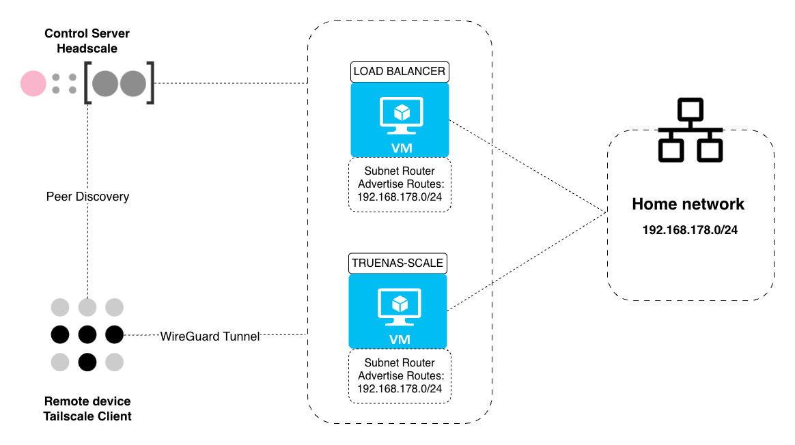

# Headscale + Headplane

Below is how Headscale and its web UI Headplane are deployed in this homelab as the VPN control server for remote access.

Headscale is a self-hosted implementation of the Tailscale control server. Tailscale clients on the load balancer VM and on TrueNAS advertise the home network subnet (example: `192.168.178.0/24`), making it accessible from anywhere as if on the local network, including SMB shares on TrueNAS and internal services that are not publicly exposed.

Headplane provides a web UI at `https://<VPN-HOSTNAME>.<YOUR-DOMAIN>/admin` for managing nodes, users, and pre-auth keys. Headscale handles all Tailscale client traffic at the root path on the same hostname.



---

## 1. Prerequisites

| Requirement | Details |
|---|---|
| Running RKE2 cluster | See [rke2-bootstrap.md](../../rke2-bootstrap.md) |
| NFS provisioner | See [nfs-provisioner.md](../storage/nfs-provisioner.md) - PVCs use `nfs-truenas` |
| Wildcard TLS certificate | See [cert-manager-cloudflare.md](../core/cert-manager-cloudflare.md) - `wildcard-prod-tls` must be available in the `headscale` namespace via Reflector |
| Public DNS record | `<YOUR-DOMAIN>` must point to the router public IP via Cloudflare, with port 443 forwarded from the router to the load balancer VM |


## 2. Architecture

Headscale and Headplane run as two containers in the same pod and share volumes:

```
Pod: headscale
  - container: headscale   (port 8080)
  - container: headplane   (port 3000)

Shared volumes:
  pvc-headscale         -> /var/lib/headscale   (DB, keys, extra-records.json)
  pvc-headscale-config  -> /etc/headscale       (config.yaml, writable at runtime)
  pvc-headplane         -> /var/lib/headplane   (Headplane SQLite DB)
  socket (emptyDir)     -> /var/run/headscale   (Unix socket)
```

### ConfigMap seed pattern

The `headscale-config` ConfigMap is used as a **seed only**. On first boot, an initContainer copies `config.yaml` from the ConfigMap to `pvc-headscale-config`. From that point on the PVC is the source of truth. Headplane can edit `config.yaml` via the UI and changes survive pod restarts.

> To force a reset from the ConfigMap, delete `config.yaml` from the PVC and restart the Deployment:
> ```bash
> kubectl -n headscale exec deploy/headscale -c headscale -- rm /etc/headscale/config.yaml
> kubectl -n headscale rollout restart deploy/headscale
> ```

### Ingress routing

Both services are exposed on `<VPN-HOSTNAME>.<YOUR-DOMAIN>` via a single Ingress:

| Path | Backend | Purpose |
|---|---|---|
| `/admin` | headplane:3000 | Headplane web UI |
| `/` | headscale:8080 | Tailscale client traffic |


## 3. Deploy

Generate the cookie secret before applying:

```bash
openssl rand -hex 16
```

Before applying, replace all placeholders across the manifest files:

| Placeholder | File(s) | Description |
|---|---|---|
| `<COOKIE-SECRET>` | `secret.yaml` | the generated hex string |
| `<VPN-HOSTNAME>.<YOUR-DOMAIN>` | `configmaps.yaml`, `ingress.yaml` | public hostname for Headscale/Headplane |
| `<MAGIC-DNS-DOMAIN>` | `configmaps.yaml` | Headscale Magic DNS base domain |

Then apply all manifests in order:

```bash
kubectl apply -f infra/k8s/apps/headscale/namespace.yaml
kubectl apply -f infra/k8s/apps/headscale/pvc.yaml
kubectl apply -f infra/k8s/apps/headscale/configmaps.yaml
kubectl apply -f infra/k8s/apps/headscale/secret.yaml
kubectl apply -f infra/k8s/apps/headscale/deployment.yaml
kubectl apply -f infra/k8s/apps/headscale/ingress.yaml
```

Wait for the pod to be ready:

```bash
kubectl get pods -n headscale
```


## 4. Post-Deploy: Generate the API Key

The API key is what you use to log into the Headplane UI. The `cookie_secret` in the Secret is only used to encrypt session cookies, not for authentication. Generate the key once the pod is running, the expiration is set to a very large value for a single long-lived personal key:

```bash
kubectl -n headscale exec deploy/headscale -c headscale -- headscale apikeys create --expiration 99999d
```

Copy the printed key (it is shown only once).


## 5. Access Headplane

Open `https://<VPN-HOSTNAME>.<YOUR-DOMAIN>/admin` in a browser. Log in using the API key generated in the previous step.


## 6. Connecting Clients

### 6.1 Create an admin user

In Headplane, navigate to **Users** and create a user named `admin` (or any name).

### 6.2 Generate a pre-auth key

A single reusable pre-auth key is created for the `admin` user and shared across all infrastructure VMs. Using a long expiration avoids having to rotate the key every time a new node joins.

In Headplane: **Machines -> Add Device -> Generate Pre-auth Key**

Configure the key as follows:

| Field | Value |
|---|---|
| User | `admin` |
| Key Expiration | `99999` days |
| Reusable | enabled |
| Ephemeral | disabled - infrastructure nodes must persist when offline |

Copy the generated key, it will be used when registering the load balancer VM and TrueNAS.

### 6.3 Register the load balancer VM

The load balancer VM runs a Tailscale client via Docker Compose. It uses host network mode and advertises the home network subnet so the full LAN is reachable from any Tailscale-connected device.

Copy the env file and fill in the pre-auth key generated in step 6.2:

```bash
cp infra/load-balancer/tailscale/.env.example infra/load-balancer/tailscale/.env
# edit .env and set TS_AUTHKEY
```

Then copy the compose file to the load balancer VM and start the container:

```bash
docker compose up -d
```

The client connects to Headscale, registers as `load-balancer`, and immediately starts advertising the home network routes. Routes must be approved in Headplane before other Tailscale nodes can use them: **Machines -> select the node -> Approve routes**.

### 6.4 Register TrueNAS

Tailscale is installed on TrueNAS via the built-in app catalog (community apps).

1. Navigate to **Apps -> Discover** and search for `Tailscale`
2. Install the app and configure it as follows:

**Tailscale Configuration**

| Field | Value |
|---|---|
| Hostname | `truenas-scale` (or any name) |
| Auth Key | the pre-auth key generated in step 6.2 |
| Auth Once | enabled - authenticates once, then uses saved state |
| Userspace | enabled |
| Accept DNS | disabled - routes only, no Magic DNS |
| Accept Routes | disabled - TrueNAS only advertises, does not consume routes |
| Advertise Exit Node | disabled |
| Advertise Routes | `<HOME-NETWORK-CIDR>` |
| Extra Arguments | `--login-server=https://<VPN-HOSTNAME>.<YOUR-DOMAIN>` |

**Network Configuration**

| Field | Value |
|---|---|
| Host Network | enabled |

**Resources Configuration**

| Field | Value |
|---|---|
| CPUs | 1 |
| Memory | 1024 MB |

3. Click **Install**. TrueNAS connects to Headscale and registers as a node.
4. Approve the advertised routes in Headplane: **Machines -> select the node -> Approve routes**.

Once both clients are connected and routes are approved, the home network is reachable from any device on the Tailscale network, including SMB shares on TrueNAS.

> Both the load balancer VM and TrueNAS advertise the same home network subnet. This provides redundancy: Tailscale clients use one route source at a time and automatically switch to the other if it becomes unavailable.


## 7. Connecting Personal Devices

Install the Tailscale client on any device (macOS, Windows, iOS, Android, Linux) from [tailscale.com/download](https://tailscale.com/download).

When prompted for a control server, set it to `https://<VPN-HOSTNAME>.<YOUR-DOMAIN>` instead of the default Tailscale server. Authenticate using a pre-auth key generated in Headplane, either the existing `admin` key if you are the sole administrator, or a dedicated key per user or device created via **Machines -> Add Device -> Generate Pre-auth Key**.

Once connected, the full home network is accessible as if on the local LAN.


## 8. Internal DNS Records

Headscale's Magic DNS automatically registers every connected node at `[device].<MAGIC-DNS-DOMAIN>`, no manual configuration needed for device-to-device resolution.

The **DNS Records** tab in Headplane is for additional entries not tied to a specific device: service endpoints, internal hostnames, or anything that should be reachable by name through the VPN.

A practical example is the Kubernetes API server. Adding this record:

| Name | Type | Value |
|---|---|---|
| `k8s-api.myhomelab` | A | `<LB-TAILSCALE-IP>` |

allows running `kubectl` from anywhere on the Tailscale network without exposing port 6443 publicly. The load balancer forwards the traffic to the control plane internally.

> For this to work, `k8s-api.myhomelab` must also be added as a TLS SAN on the RKE2 control plane, otherwise `kubectl` will reject the API server certificate. See the TLS SANs step in [rke2-bootstrap.md](../../rke2-bootstrap.md).

Update the kubeconfig server address to `https://k8s-api.myhomelab:6443` to use it remotely.
